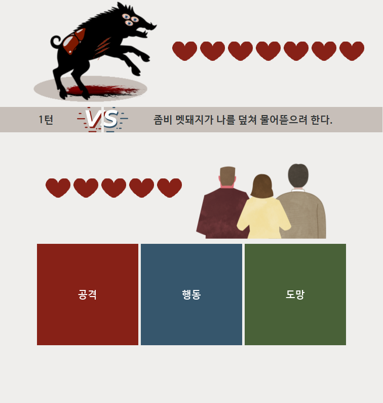
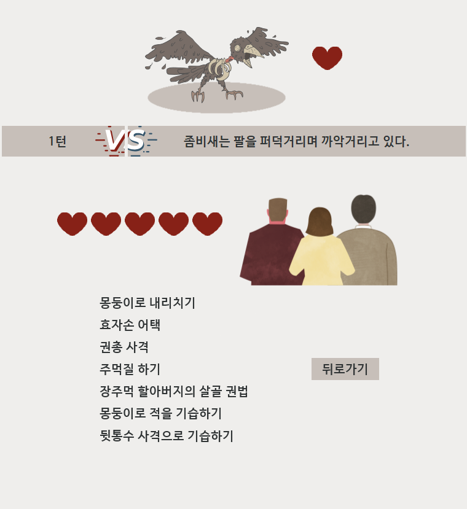
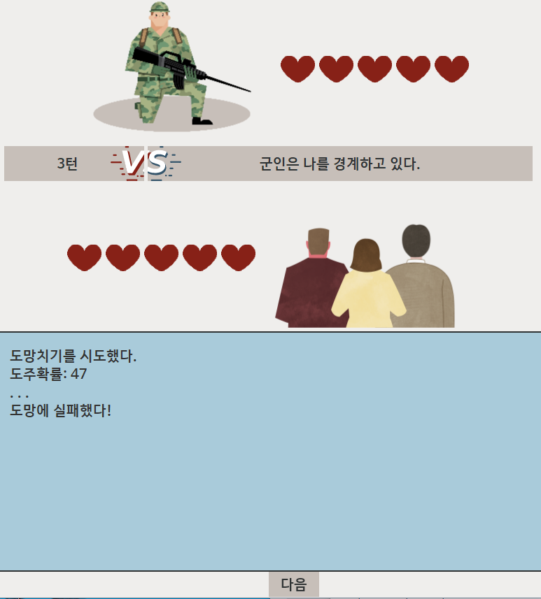
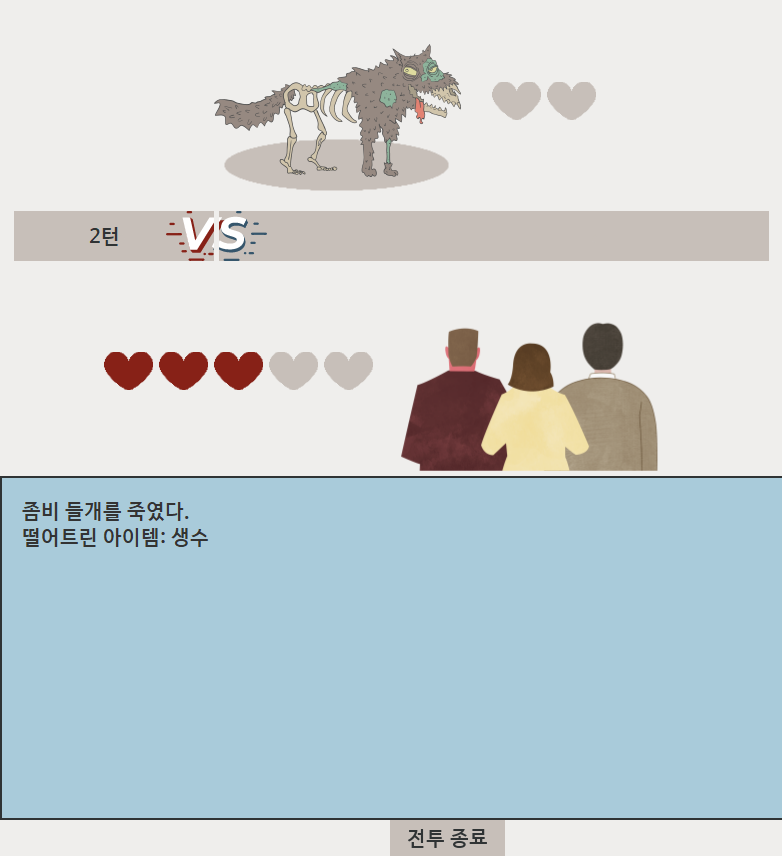

# Busan2044
텍스트 기반 생존게임 "Busan2044"의 전투모듈 / JAVA SWING
***
### 1. 프로젝트 정보
  좀비아포칼립스를 배경으로 한 다회차 생존게임 제작 프로젝트<BUSAN 2044>의 일부인 전투 모듈입니다.
  
  - 사용기술
    - JAVA 8
    - MySQL

  - 특징
    - 턴제 RPG 구성을 베이스로 하여 총3턴의 전투를 진행합니다.
    - 플레이어의 공격이나 행동은 각 동작에 할당된 "명중률"을 토대로 동작합니다. 확률에 따라 공격이 빗나가거나 치명타가 발생하기도 합니다.
    - 플레이어가 할 수 있는 공격이나 행동은 인벤토리의 소지품과 적의 상태에 따라 그 종류가 달라집니다.
    - 공격 외 “행동”을 구현하여 적의 주의를 돌리는 등 전투를 회피하는 플레이스타일 또한 제공합니다.
    - 적이 플레이어를 적대하는 정도를 적개심으로 수치화하여, 플레이어가 적을 적대할수록 적은 플레이어를 더 적대합니다.
    - 전투의 결과로 적의 공격에 따른 플레이어의 체력 감소, 아이템 획득, 플레이어의 사망 등을 출력합니다.
 
- 제작기간
  - 2022.7.22. ~ 2022.8.2.
  
- 담당업무와 기여도
  - 전투 모듈 제작
  - 프로그램 전체 기여도: 30%
  - 전투모듈 기여도: 95%

***

### 2. 프로그램 미리보기
    
    
   
   

***

### 3. LICENSE
- (C) 2022. JeonInha all rights reserved.
- 해당 프로그램에 사용된 디자인 요소들은 미리캔버스(https://www.miricanvas.com/) 를 통해 제작하였습니다.
